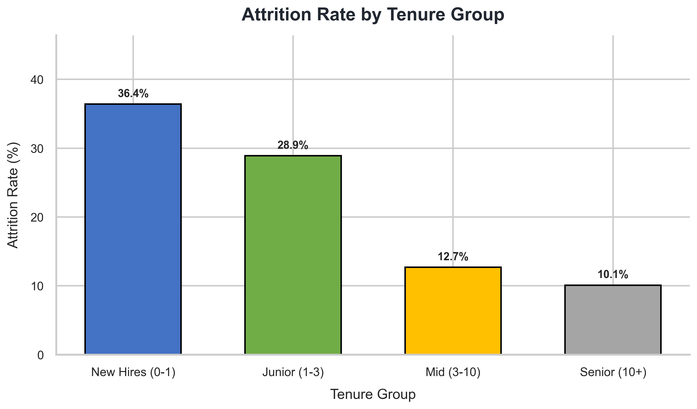
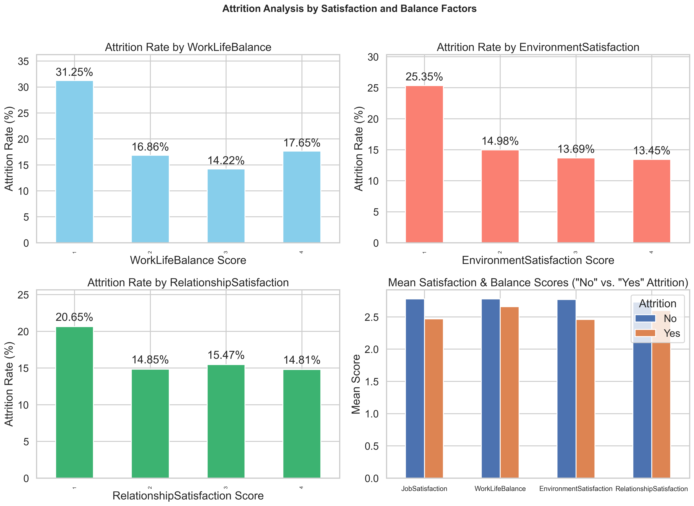
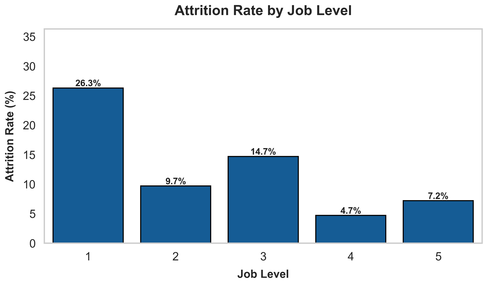

# HR Employee Attrition Analysis

## Python Data Analysis Project

This repository contains a full data analysis project focused on understanding **employee attrition**, its root causes, and actionable HR insights to improve retention.
The analysis was conducted in a Jupyter Notebook (Python_Final_Project2.ipynb) and visualized through dashboard using multiple KPI

---

## Project Structure

├── Python_Final_Project2.ipynb - Full analysis notebook (EDA, KPIs, insights)  
├── README.md - Project documentation (this file)  
├── Images - All generated plots (.png)  
├── Python Final Project.csv - HR dataset used in the analysis  
├── Dashboard - Streamlit dashboard  

---

## Project Objective

The goal of this project is to:
* Identify key factors contributing to employee attrition

* Analyze relationships between satisfaction, compensation, performance, and turnover

* Calculate HR-focused KPIs

* Build visualizations and insights for decision-makers

* Provide data-driven recommendations to reduce attrition

The final outcome is a comprehensive dashboard and analysis report summarizing attrition patterns across the organization.

---

## Dataset Overview

The dataset contains:

* 1,470 employees

* 36 features, including:

   * Demographics: Age, Gender, Marital Status, Education
   * Job details: Job Role, Department, Job Level, Years at Company
   * Compensation: Monthly Income, Stock Options, Salary Hike
   * Satisfaction metrics: Job Satisfaction, Environment Satisfaction, Work-Life Balance
   * Commute: Distance From Home
   * Performance rating
   * Attrition (Yes/No)

   ---

## Analysis Steps

1. **Data Loading & Cleaning**:
   * Imported dataset using Pandas
   * Checked missing values (none found)
   * Created calculated fields (e.g., Satisfaction Index)

2. **Exploratory Data Analysis (EDA)**:
   * Visualized distributions of income, distance, tenure
   * Cross-tabulation of attrition by demographics and departments
   * Correlation heatmap to identify strongest relationships

3. **KPI Evaluation**:  
   Based on the project guidelines, the following KPIs were analyzed:
   1. Attrition Trends & Patterns
   2. Compensation & Benefits Analysis
   3. Work-Life Balance & Satisfaction
   4. Career Growth & Job Stability
   5. Geographic & Commuting Factors

---

## Key Visual Insights (Dashboard Highlights)

Below is a sample from the dashboard included in this project, showcasing major KPIs and charts:

### KPI 1: **Attrition Trends and Patterns (by attrition rate)**

Below are several graphs that together provide a comprehensive overview of attrition trends and patterns:

**Attrition Concentration Across Tenure Groups**

   

---

### KPI 2: **Compensation and Benefits Analysis**

**Average Monthly Income by Department**

_graph.png)

---

### KPI 3: **Work-Life Balance and Satisfaction:**

**Attrition Analysis by Satisfaction and Balance Factors**

---

### KPI 4: **Career Growth and Job Stability**

**Attrition Rate by Job Level (%)**

---

### KPI 5: **Geographic and Commuting Factors**

**Attrition Rate (%) by Distance Group**

---

## Summary of Findings

From the analysis, several important patterns were identified:

   * Low Work-Life Balance strongly correlates with higher attrition
   * Employees with lower salaries tend to leave more frequently
   * Attrition is significantly higher among employees with short tenure (0–2 years)
   * Job roles such as Sales Representative show higher turnover compared to others
   * Longer commute distances increase the likelihood of leaving
   * Employees with fewer promotion opportunities show greater attrition risk

---

## Recommendations

Based on the findings:

   1. **Improve Work-Life Balance**  
      Introduce hybrid models, flexible hours, and promote healthy workload practices.

   2. **Review Compensation Structure**  
      Adjust salary for lower-level positions and ensure competitive packages. 
   
   3. **Support New Employees**  
      Strengthen onboarding and mentorship programs in the first 1–2 years.
   
   4. **Analyze High-Turnover Job Roles**  
      Evaluate workload, job expectations, and development paths.

   5. **Allow Partial Remote Options for Long Commutes**  
      This can significantly reduce attrition for far-distance employees.

   6. **Establish Transparent Career Paths**  
      Promote internal mobility and define promotion timelines.

By implementing these strategies, HR can reduce attrition, improve employee satisfaction, and foster long-term organizational success.

---

## Authors:
Ofir Ben-Harush, Tal Ezra, Neta Shtayer, Zvi Fuchs, Yelena Zamansky Glazer, Tehila Hamdi  
Python | SQL | Tableau | Visualization

